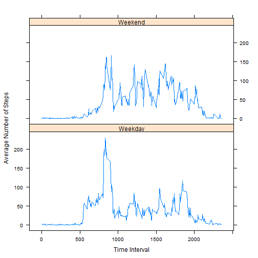

"Reproducible Research: Peer Assessment 1"
=========================================

This document contains chunks of R code that are written to develop solutions
to the questions presented in the Peer Assessment 1 assignment.  Additionally,
they will also generate histograms and line plots as specified in the 
instructions.

## Loading and preprocessing the data
The following R code will read in the data from the file "activity.csv" and
will store it in a variable called "raw_data".  The three variables in the dataset are

- steps: an integer that represents the number of  steps taken during a 5- minute interval (with some NA values)
- date: a factor (in the form YYYY-MM-DD) that represents the date on which the measurement was recorded (the dates span the 61 days from October 1 through November 30 of 2012)
- interval: an integer (in the form HHMM with leading zeros omitted) that represents the 5-minute interval during over which the measurement was taken and recorded


```r
raw_data <- read.csv("activity.csv")
```

## What is mean total number of steps taken per day?

In this section, code is written that computes the number of steps taken each day.  To do this, the data is split by date and the sum is taken for each date.  Note that time intervals that have missing values (NA) are ignored in the computation of the sum.  The 61 sums (one for each of the 61 days) will be displayed in a histogram.  The R code and the histogram are shown below.


```r
day <- split(raw_data, raw_data$date)
day_sum <- sapply(day, function(x) sum(x[,"steps"], na.rm=TRUE))
hist(day_sum, c = "blue", xlab = "Steps", main = "Histogram of Daily Steps")
```

 

The following trivial R code computes the mean value and the median value of 
the total number of steps taken per day.


```r
mean <- mean(day_sum)
median <- median(day_sum)
```

As computed through the R code, the mean value is 9354.2295082 and the median value is 10395 total daily steps.

## What is the average daily activity pattern?

Now, we develop the R code that will make a time series plot of the average number of steps taken for each of the 5-minute intervals.  This is accomplished by splitting the raw data according to its interval.  The mean value is computed  for each of the 288 5-minute intervals and the base plotting system is used to plot the line graph.  It is worth noting that the "Interval"" axis here (and for every other graph  with an "Interval" that follows in this document) is not a linear scale because each clock hour only has 60 minutes and not 100 minutes.  So, for example, while the interval 940 has meaning (9th hour, 40th minute), the intervals 960 - 999 are meaningless and don't exist.


```r
steps_by_interval <- split(raw_data, raw_data$interval)
avg_steps_by_interval <- sapply(steps_by_interval,function(x) mean(x[,"steps"],
                                na.rm=TRUE))
plot(as.numeric(names(avg_steps_by_interval)),avg_steps_by_interval,type="l",
     xlab="Interval", ylab="Steps", 
     main="Avererage Number of Steps by Interval")
```

 

The 5-minute interval that contains the maximum average number of steps is indicated in the plot wit the highest peak.  The R code that computes the interval where the tallest peak occurs is


```r
max = as.numeric(names(avg_steps_by_interval[avg_steps_by_interval == 
                  max(avg_steps_by_interval)]))
```

The interval with the maximum "average number of steps" is interval "835".

## Imputing missing values

Up to this point, missing data has been "ignored", essentially assuming that the data value was 0 everywhere that an NA was recorded in the data set.  The following R code computes exactly how many missing data values there are.


```r
isna_logical <- is.na(raw_data$steps)
number_of_missing_values <- sum(isna_logical)
```

There are a total of 2304 missing values in the raw data.

Ignoring missing data values may not necessarily be a good approach to help with interpreting the dataset (especially when considering the total number of steps per day), so the following R code will use an alternate method of handling missing data values.  The R code utilizes the mean values for each 5-minute interval as computed in the previous section, then fills in the missing data with the mean values that correspond to the time intervals in which the data has a missing value.  The new dataset that has no NA values is called "data2".


```r
data2 <- raw_data
for(i in 1:length(isna_logical)){
        if(isna_logical[i] == TRUE){
                data2[i,"steps"] <- avg_steps_by_interval[as.character(data2[i,
                                                                "interval"])]
        }
                  
}
```

With the new dataset (data2), the total number of steps per day is re-calculated and a new histogram is plotted, both done with the following R code:


```r
day2 <- split(data2, data2$date)
day_sum2 <- sapply(day2, function(x) sum(x[,"steps"]))
hist(day_sum2, c = "blue", xlab = "Steps", main = "Histogram of Daily Steps (NA's Replaced)")
```

 

As in the first section of this assignment, the mean and median values for the total number of steps taken per day are computed with this remarkably similar R code! 


```r
mean2 <- mean(day_sum2)
median2 <- median(day_sum2)
```

As computed through the R code, the mean value is 1.0766189 &times; 10<sup>4</sup> and the median value is 1.0766189 &times; 10<sup>4</sup> total daily steps.  Because the new method assumes a non-zero value for the NA data, we would expect to see an increase in the total number of steps per day for days that had NA date entries, and therefore the mean number of steps per day is expected to be larger than the mean value computed in the first section.  We see, from the data that the median value is also increased from before, but there's no way of predicting that it would have increased, decreased, or stayed the same, because the change in median value is determined by where the NA data values occurred.

## Are there differences in activity patterns between weekdays and weekends?

In this final section, we present  R code that will help us compare the number of steps taken during weekdays and the number of steps taken during weekend days.  For this analysis, weekend days are assumed to be Saturday and Sunday (even though some of my colleagues consider Friday to be a weekend day!).  Note that in this work, we use the dataset from the previous section (i.e. that has NA's replaced with mean values.)

We first create a new factor variable that will indicate whether a given day/date is a weekday or a weekend day.


```r
data2$day_of_week <- weekdays(as.Date(data2$date))
for(i in 1:length(data2$day_of_week)){
        if(data2$day_of_week[i]=="Sunday" | data2$day_of_week[i]=="Saturday"){
                data2$day_of_week[i] <- "weekend"
        } else {
                data2$day_of_week[i] <- "weekday"
        }
}
data2$day_of_week <- as.factor(data2$day_of_week)
```

Now, we split the data into two groups - the weekday group and the weekend group.


```r
data3 <- split(data2, data2$day_of_week)
```

Finally, each of these two groups will be split by interval, the mean values of the intervals will be taken, and a plot of the mean number of steps vs interval will be constructed for each using the lattice plotting system.


```r
## First, begin with the weekday data.
weekday <- split(data3$weekday, (data3$weekday)$interval)
weekday_interval_avg <- sapply(weekday, function(x) mean(x[,"steps"]))
##  Now the weekend data.
weekend <- split(data3$weekend, (data3$weekend)$interval)
weekend_interval_avg <- sapply(weekend, function(x) mean(x[,"steps"]))
## Plot the results.
tmp1 <- cbind(names(weekday_interval_avg),weekday_interval_avg, rep("Weekday",
                                    length(weekday_interval_avg) ))
tmp2 <- cbind(names(weekend_interval_avg),weekend_interval_avg, rep("Weekend",
                                    length(weekend_interval_avg) ))
data4 <- as.data.frame(rbind(tmp1,tmp2))
names(data4) <- c("interval", "steps", "day_category")
data4$interval <- as.numeric(as.character(data4$interval))
data4$steps <- as.numeric(as.character(data4$steps))
library(lattice)
xyplot(steps ~ interval | day_category, data =  data4, type = "l", xlab="Time Interval", ylab="Average Number of Steps",layout= c(1,2) )
```

 

Looking at the two plots, there appear to be some diferences between the average number of steps taken on weekdays compared to the average number of steps taken on weekend days.  Weekend days seem to have less activity in the earlier morning hours (5-8 AM) and more activity during the hours from 10 AM to 8 PM.    
